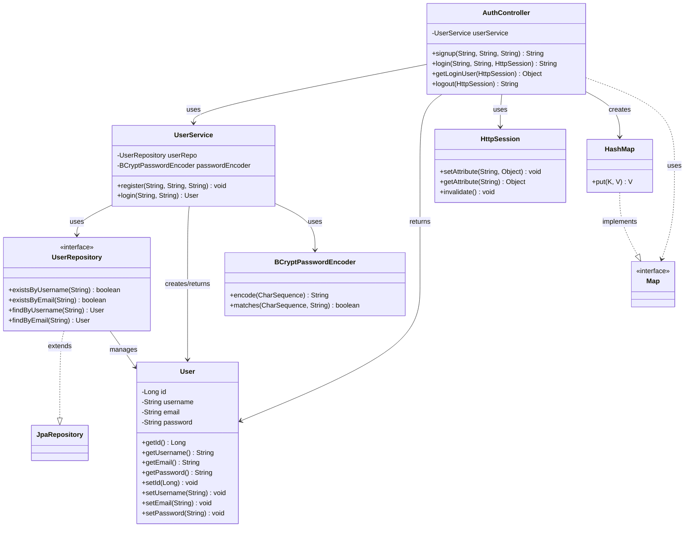

# AuthController 클래스 다이어그램

## Mermaid 형식

## 클래스 설명

### AuthController
- **역할**: 인증 관련 HTTP 요청을 처리하는 Spring Controller
- **주요 메서드**:
  - `signup()`: 회원가입 처리
  - `login()`: 로그인 처리 및 세션 저장
  - `getLoginUser()`: 현재 로그인된 사용자 정보 조회
  - `logout()`: 로그아웃 처리 (세션 무효화)

### UserService
- **역할**: 사용자 관련 비즈니스 로직 처리
- **주요 메서드**:
  - `register()`: 사용자 등록 (이메일/비밀번호 검증 포함)
  - `login()`: 사용자 로그인 검증

### User
- **역할**: 사용자 엔티티 (JPA)
- **속성**: id, username, email, password

### UserRepository
- **역할**: 사용자 데이터 접근을 위한 JPA Repository 인터페이스

