# HSCodeSearch 전체 클래스 다이어그램

## PlantUML 다이어그램
PlantUML 파일: `Complete_ClassDiagram.puml`

## Mermaid 다이어그램

```mermaid
classDiagram
    %% Entity Classes
    class User {
        -Long id
        -String username
        -String email
        -String password
        +getId() Long
        +getUsername() String
        +getEmail() String
        +getPassword() String
        +setId(Long) void
        +setUsername(String) void
        +setEmail(String) void
        +setPassword(String) void
    }
    
    class HsCode {
        -Long id
        -String hsCode
        -String nameKor
        -String nameEng
        -String exportCode
        -String importCode
        -String unifiedCode
        -String unifiedName
        +HsCode()
        +getId() Long
        +getHsCode() String
        +setHsCode(String) void
        +getNameKor() String
        +setNameKor(String) void
        +getNameEng() String
        +setNameEng(String) void
        +getExportCode() String
        +setExportCode(String) void
        +getImportCode() String
        +setImportCode(String) void
        +getUnifiedCode() String
        +setUnifiedCode(String) void
        +getUnifiedName() String
        +setUnifiedName(String) void
    }
    
    class Bookmark {
        -Long id
        -User user
        -String hsCode
        -String nameKor
        -String nameEng
        +Bookmark()
        +Bookmark(User, String, String, String)
        +getId() Long
        +getUser() User
        +setUser(User) void
        +getHsCode() String
        +setHsCode(String) void
        +getNameKor() String
        +setNameKor(String) void
        +getNameEng() String
        +setNameEng(String) void
    }
    
    class History {
        -Long id
        -User user
        -String hsCode
        -String nameKor
        -String nameEng
        -LocalDateTime createdAt
        +History()
        +History(User, String, String, String)
        +onCreate() void
        +getId() Long
        +getUser() User
        +setUser(User) void
        +getHsCode() String
        +setHsCode(String) void
        +getNameKor() String
        +setNameKor(String) void
        +getNameEng() String
        +setNameEng(String) void
        +getCreatedAt() LocalDateTime
        +setCreatedAt(LocalDateTime) void
    }
    
    class UsTariff {
        -Long id
        -String hs6Code
        -String hsCode
        -String descEng
        -String descKor
        -String rateGeneral
        -String rateSpecial
        -String rateDuty2
        -String unit
        -String usCode
        -Integer year
        +getId() Long
        +setId(Long) void
        +getHs6Code() String
        +setHs6Code(String) void
        +getHsCode() String
        +setHsCode(String) void
        +getDescEng() String
        +setDescEng(String) void
        +getDescKor() String
        +setDescKor(String) void
        +getRateGeneral() String
        +setRateGeneral(String) void
        +getRateSpecial() String
        +setRateSpecial(String) void
        +getRateDuty2() String
        +setRateDuty2(String) void
        +getUnit() String
        +setUnit(String) void
        +getUsCode() String
        +setUsCode(String) void
        +getYear() Integer
        +setYear(Integer) void
    }
    
    class HsUsMapping {
        -Long id
        -String hs6Code
        -String koreaHs10
        -String hsCode
        -String usCode
        -Integer priority
        -String note
        +getId() Long
        +setId(Long) void
        +getHs6Code() String
        +setHs6Code(String) void
        +getKoreaHs10() String
        +setKoreaHs10(String) void
        +getHsCode() String
        +setHsCode(String) void
        +getUsCode() String
        +setUsCode(String) void
        +getPriority() Integer
        +setPriority(Integer) void
        +getNote() String
        +setNote(String) void
    }
    
    %% Controller Classes
    class AuthController {
        -UserService userService
        +signup(String, String, String) String
        +login(String, String, HttpSession) String
        +getLoginUser(HttpSession) Object
        +logout(HttpSession) String
    }
    
    class AuthPageController {
        +loginPage() String
        +signUpPage() String
    }
    
    class BookmarkController {
        -BookmarkRepository bookmarkRepository
        +bookmarkPage() String
        +getBookmarks(HttpSession) ResponseEntity
        +addBookmark(String, String, String, HttpSession) ResponseEntity
        +deleteBookmark(String, HttpSession) ResponseEntity
        +checkBookmark(String, HttpSession) ResponseEntity
    }
    
    class DetailController {
        +detailPage() String
    }
    
    class HistoryController {
        -HistoryRepository historyRepository
        +historyPage() String
        +getHistory(HttpSession) ResponseEntity
        +addHistory(String, String, String, HttpSession) ResponseEntity
        +clearHistory(HttpSession) ResponseEntity
    }
    
    class HomeController {
        +home() String
    }
    
    class SearchController {
        -HsCodeRepository repo
        +SearchController(HsCodeRepository)
        +search(String) List~HsCode~
        +detail(String) HsCode
    }
    
    class TariffController {
        -TariffService tariffService
        +TariffController(TariffService)
        +getUsTariff(String) ResponseEntity
    }
    
    %% Service Classes
    class UserService {
        -UserRepository userRepo
        -BCryptPasswordEncoder passwordEncoder
        +register(String, String, String) void
        +login(String, String) User
    }
    
    class TariffService {
        -HsUsMappingRepository hsUsMappingRepository
        -UsTariffRepository usTariffRepository
        +TariffService(HsUsMappingRepository, UsTariffRepository)
        +getUsTariffByHsCode(String) Optional~UsTariff~
    }
    
    %% Repository Interfaces
    class UserRepository {
        <<interface>>
        +existsByUsername(String) boolean
        +existsByEmail(String) boolean
        +findByUsername(String) User
        +findByEmail(String) User
    }
    
    class HsCodeRepository {
        <<interface>>
        +findByHsCodeContainingOrNameKorContainingOrNameEngContaining(String, String, String) List~HsCode~
        +findByHsCode(String) HsCode
    }
    
    class BookmarkRepository {
        <<interface>>
        +findByUser(User) List~Bookmark~
        +findByUserAndHsCode(User, String) Optional~Bookmark~
        +existsByUserAndHsCode(User, String) boolean
        +deleteByUserAndHsCode(User, String) void
    }
    
    class HistoryRepository {
        <<interface>>
        +findByUserOrderByCreatedAtDesc(User) List~History~
        +deleteAllByUser(User) void
        +countByUser(User) long
    }
    
    class UsTariffRepository {
        <<interface>>
        +findByHs6Code(String) Optional~UsTariff~
        +findByUsCode(String) Optional~UsTariff~
        +findFirstByHs6CodeOrderByIdAsc(String) Optional~UsTariff~
    }
    
    class HsUsMappingRepository {
        <<interface>>
        +findByHs6Code(String) Optional~HsUsMapping~
        +findByKoreaHs10(String) Optional~HsUsMapping~
        +findFirstByHs6CodeOrderByPriorityAscIdAsc(String) Optional~HsUsMapping~
    }
    
    %% DTO Classes
    class HsCodeEntry {
        -String code
        -String name
        -String description
        +HsCodeEntry()
        +HsCodeEntry(String, String, String)
        +getCode() String
        +getName() String
        +getDescription() String
    }
    
    class UsTariffResponse {
        -String usCode
        -String descEng
        -BigDecimal rateGeneral
        -BigDecimal rateSpecial
        +UsTariffResponse()
        +UsTariffResponse(String, String, BigDecimal, BigDecimal)
        +getUsCode() String
        +setUsCode(String) void
        +getDescEng() String
        +setDescEng(String) void
        +getRateGeneral() BigDecimal
        +setRateGeneral(BigDecimal) void
        +getRateSpecial() BigDecimal
        +setRateSpecial(BigDecimal) void
    }
    
    %% Config Classes
    class SecurityConfig {
        +filterChain(HttpSecurity) SecurityFilterChain
    }
    
    class PasswordConfig {
        +passwordEncoder() BCryptPasswordEncoder
    }
    
    %% Loader Classes
    class HsUsMappingLoader {
        -HsCodeRepository hsCodeRepository
        -HsUsMappingRepository hsUsMappingRepository
        -UsTariffRepository usTariffRepository
        +HsUsMappingLoader(HsCodeRepository, HsUsMappingRepository, UsTariffRepository)
        +run(ApplicationArguments) void
        -isMoreSpecific(String, String) boolean
        -extractDigits(String) String
        -safeSix(String) String
    }
    
    class UsTariffLoader {
        -UsTariffRepository usTariffRepository
        +UsTariffLoader(UsTariffRepository)
        +run(ApplicationArguments) void
        -parseCsvLine(String) String[]
        -safeTrim(String[], int) String
        -extractHs6(String) String
        -cleanValue(String) String
        -parseYear(String) Integer
    }
    
    %% Application Class
    class HsCodeSearchApplication {
        +main(String[]) void
    }
    
    %% Relationships - Entity
    Bookmark "N" --> "1" User : @ManyToOne
    History "N" --> "1" User : @ManyToOne
    
    %% Relationships - Controller to Service/Repository
    AuthController --> UserService : uses
    BookmarkController --> BookmarkRepository : uses
    BookmarkController --> User : uses
    HistoryController --> HistoryRepository : uses
    HistoryController --> User : uses
    SearchController --> HsCodeRepository : uses
    TariffController --> TariffService : uses
    
    %% Relationships - Service to Repository
    UserService --> UserRepository : uses
    UserService --> User : creates
    TariffService --> HsUsMappingRepository : uses
    TariffService --> UsTariffRepository : uses
    TariffService --> UsTariff : returns
    TariffService --> HsUsMapping : uses
    
    %% Relationships - Repository to Entity
    UserRepository ..> User : manages
    HsCodeRepository ..> HsCode : manages
    BookmarkRepository ..> Bookmark : manages
    HistoryRepository ..> History : manages
    UsTariffRepository ..> UsTariff : manages
    HsUsMappingRepository ..> HsUsMapping : manages
    
    %% Relationships - Loader
    HsUsMappingLoader --> HsCodeRepository : uses
    HsUsMappingLoader --> HsUsMappingRepository : uses
    HsUsMappingLoader --> UsTariffRepository : uses
    HsUsMappingLoader --> HsCode : uses
    HsUsMappingLoader --> HsUsMapping : creates
    HsUsMappingLoader --> UsTariff : uses
    UsTariffLoader --> UsTariffRepository : uses
    UsTariffLoader --> UsTariff : creates
```

## 클래스 통계

### Entity 클래스 (6개)
- User
- HsCode
- Bookmark
- History
- UsTariff
- HsUsMapping

### Controller 클래스 (8개)
- AuthController
- AuthPageController
- BookmarkController
- DetailController
- HistoryController
- HomeController
- SearchController
- TariffController

### Service 클래스 (2개)
- UserService
- TariffService

### Repository 인터페이스 (6개)
- UserRepository
- HsCodeRepository
- BookmarkRepository
- HistoryRepository
- UsTariffRepository
- HsUsMappingRepository

### DTO 클래스 (2개)
- HsCodeEntry
- UsTariffResponse

### Config 클래스 (2개)
- SecurityConfig
- PasswordConfig

### Loader 클래스 (2개)
- HsUsMappingLoader
- UsTariffLoader

### Application 클래스 (1개)
- HsCodeSearchApplication

**총 클래스 수: 29개**
